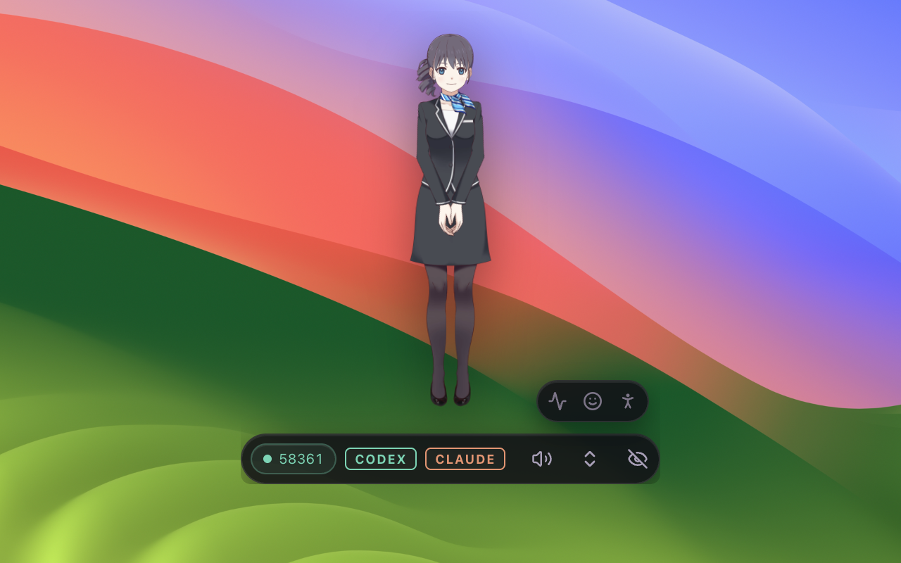
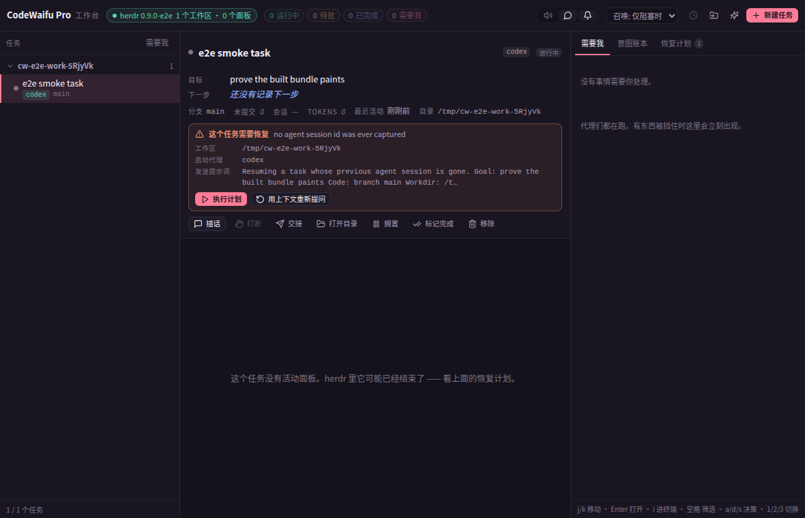

# CodeWaifu

[Landing page](https://robotworld.top/en/codewaifu) · [中文文档](README.zh-CN.md) · [Releases](https://github.com/flowinginthewind700/codewaifu/releases) · [MIT](LICENSE)

**A desktop companion that lives next to your coding agents.** CodeWaifu sits in
your menu bar as a small, draggable, always-on-top character. It listens to
Codex and Claude Code through their hook systems, speaks every event that needs
you out loud, keeps a live board of all your agent threads, lets you steer them
without leaving the keyboard, and drives your music player while you work.



## Why

Long agent runs are silent. A build finishes, a permission request waits, a
thread goes idle - and you find out twenty minutes later, when you happen to
look. CodeWaifu turns those moments into a voice and a glance: a spoken line in
Chinese or English, a bubble above the character, and a thread list that shows
what every agent is doing right now.

## Features

- **Speaks your agents.** Hook events from Codex and Claude Code (session start,
  stop, permission request, notification, tool call, compaction, subagent,
  interrupt) become short spoken lines through the system TTS, with per-event
  toggles and a phrase pool so the same event never sounds identical twice.
- **Bilingual by default.** Language is auto-detected per message (one CJK
  character switches the voice), or pinned to Chinese / English in Settings.
- **A greeting, not a splash screen.** On launch the companion says something
  time-of-day appropriate, chosen at random from a pool.
- **Thread board.** Every Codex thread and Claude Code session with live status;
  steer a running Codex thread by queueing a message, or copy the message for
  agents without an injection API.
- **Media transport.** Play / pause / next / previous for the player that owns
  your system session (Music and Spotify on macOS, the system session on
  Windows, any MPRIS player through `playerctl` on Linux), with the current
  track shown in the panel.
- **A window that behaves.** Draggable anywhere, always-on-top, click-through
  when you want it ghosted, opacity and scale sliders, collapses to a 320px
  bubble and expands to a full panel with tabs.
- **A tray that answers.** The tray menu shows or hides the stage, opens the
  Bench with its attention count in the label, mutes the voice, repairs the
  agent hooks and quits. On Linux a left click on the icon opens that menu,
  because the platform delivers no click of its own; on macOS and Windows the
  left click summons her and the right click opens the menu.
- **Loopback only.** The relay binds `127.0.0.1`, every route except `/health`
  needs a per-install token, and the Host header is validated. No telemetry,
  no network egress, no sudo.

## Pro: a cockpit over your agents' terminals

The companion answers *which agent needs me right now*. The Bench answers the
next question: what is every one of them doing, in their own terminals, without
opening nine windows. Pro is a second window over
[herdr](https://github.com/herdrdev/herdr), the durable terminal runtime that
owns the PTYs - tasks, workspaces and panes outlive the Bench closing, the
machine sleeping, and the app crashing.



- **One tree, every repo.** herdr workspaces and tasks, ordered the way you
  scan them: what needs you first, what is running, what finished.
- **Terminals rented, not owned.** Each pane is a live
  `herdr terminal session control` connection: Unicode 11 widths, WebGL with a
  DOM fallback, OSC 8 links through a scheme allow-list, OSC 52 clipboard, and
  find with regex and case modes. Closing the Bench kills nothing.
- **An attention queue.** Permission requests and blockers collect in one list
  with approve / deny / snooze, and the companion bubble can answer in words.
- **A ledger and a recovery plan.** Every decision is append-only on disk, and a
  task whose agent session died gets a resume prompt you can run or re-ask.
- **Shells and ssh, in the same tree.** A pane does not have to hold an agent.
  `t` opens a local shell in the selected task's directory; `c` opens a connect
  palette over your pinned machines, your `~/.ssh/config` aliases, and whatever
  you type - `user@host:port`, or a whole `ssh ...` line pasted straight from a
  README. Each row can be probed for passwordless login, pinned, or handed to
  `ssh-copy-id`, and the answer is in words ("needs a password") rather than an
  exit code.
- **Keyboard first.** `j/k` move, `Enter` opens, `i` hands the keyboard to a
  terminal, `Shift+Tab` takes it back, `a/d/s` decide, `1/2/3` switch panels,
  `c` connects, `t` opens a shell.

Pro is Linux-first and needs herdr 0.9+ running; with no herdr the Bench shows
an install card instead of crashing. Open it from the tray menu (the bench row
carries the attention count), or set `pro.openBenchOnLaunch` in
`~/.codewaifu/config.json`.

## Install

One line, macOS or Linux:

```bash
curl -fsSL https://raw.githubusercontent.com/flowinginthewind700/codewaifu/main/scripts/install.sh | bash
```

One line, Windows (PowerShell):

```powershell
irm https://raw.githubusercontent.com/flowinginthewind700/codewaifu/main/scripts/install.ps1 | iex
```

The installer downloads the latest release, places the app in `/Applications`
(Windows: `%LOCALAPPDATA%\Programs\CodeWaifu`, Linux: `~/.local/share/CodeWaifu`),
registers the agent hooks with backups, and prints what to do next. Re-running
it repairs an install; `bash install.sh --uninstall --purge` removes it again.

It also installs herdr, the terminal runtime the Bench drives, unless a binary
already sits where the app looks for one. `--no-herdr` skips that step and
`--herdr-only` runs nothing else, which is the fix for a Bench that shows the
install card over an otherwise complete install. A herdr download that fails
only warns: the companion is whole without it. Uninstalling leaves herdr alone,
because it owns terminals that outlive this app.

### Linux

Two supported shapes. Pick by whether you want the Chromium sandbox:

| | command | lands in | sandbox |
| --- | --- | --- | --- |
| user install | the one-liner above | `~/.local/share/CodeWaifu`, launcher in `~/.local/bin/codewaifu`, entry in `~/.local/share/applications` | runs unsandboxed on kernels that refuse unprivileged user namespaces |
| system install | `sudo apt install ./CodeWaifu-0.3.0-linux-amd64.deb` | `/opt/CodeWaifu` | full: the postinst adds an AppArmor profile and a setuid sandbox helper |

The user install never needs root, which is also why it cannot set the sandbox
up. Ubuntu 23.10+ ships `kernel.apparmor_restrict_unprivileged_userns=1`, and
under it Chromium refuses to start unconfined - it aborts before any JavaScript
runs, so the app cannot fix this from the inside. The launcher the installer
wires up (`AppRun`, which electron-builder puts in every AppImage) probes for
exactly that at every start and passes `--no-sandbox` only when the kernel
really refuses. To keep the sandbox instead, install the `.deb`, or relax the
restriction:

```bash
sudo sysctl -w kernel.apparmor_restrict_unprivileged_userns=0
```

Shared libraries the app needs (a stock Ubuntu desktop already has them; the
installer runs `ldd` and names any that are missing):

```bash
sudo apt install libgtk-3-0t64 libnotify4 libnss3 libxss1 libxtst6 \
  libatspi2.0-0t64 libsecret-1-0 libasound2t64
```

Optional, and each one turns a feature on:

- `playerctl` - media transport, against any MPRIS player (Spotify, Rhythmbox,
  VLC, mpd...). Without it the transport row says `playerctl not installed`.
- `espeak-ng` - the OS-voice fallback. The bundled neural Matcha voice needs
  nothing installed; this is only the second choice behind it.
- `gnome-shell-extension-appindicator` - GNOME has no tray by default, so
  without it the icon cannot appear. Log out and back in after installing.

Useful flags: `--autostart` also drops the entry into `~/.config/autostart`,
`--from <path>` installs a local `.AppImage` / `.deb` / build directory through
the same code path, `--version vX.Y.Z` pins a release.

Verified on Ubuntu 24.04 (GNOME, X11). On a Wayland session she still runs, but
the click-through input shape and the compositor probe are X11 calls, so an X11
session (or XWayland) is what those two features were tested against.

### Windows

Per-user, no admin prompt: it installs into the `%LOCALAPPDATA%` location named
above, with the Start-menu shortcut and the uninstaller entry NSIS writes, and
the hooks land in your Codex and Claude Code config folders exactly as they do
on the other platforms. A release carries both a setup and a portable artifact;
the installer prefers the setup one, because that is what writes the shortcut
and the uninstaller. The build is x64 and unsigned, so SmartScreen asks once
(More info > Run anyway), and on Windows on ARM it runs emulated - the installer
says so out loud instead of leaving you to wonder about a slow first launch.

Switches cannot survive a bare `| iex`, so hand them to the script through a
script block:

```powershell
iex "& { $(irm https://raw.githubusercontent.com/flowinginthewind700/codewaifu/main/scripts/install.ps1) } -From C:/builds/CodeWaifu-0.3.0-win-x64-setup.exe"
```

- `-From PATH` installs a local artifact through the same code path as a
  download: a `*-setup.exe`, a `*-portable.exe`, or a `win-unpacked` build
  directory - the last is the tree CI produces, so it is the quickest way to try
  a local build without publishing anything.
- `-Version 'v0.3.0'` pins a release instead of taking the newest.
- `-HooksOnly` re-registers the hooks for an app that is already installed.
- `-Uninstall [-Purge]` removes the hooks (agent configs are backed up first)
  and, with `-Purge`, the app.

Verified how far: CI on `windows-latest` runs the full test suite - including
twelve end-to-end `install.ps1` scenarios against a stubbed release feed - and
then smoke-tests the packaged binary headlessly (`--cli help`,
`--cli status --json`). Pasting the bash one-liner into Git Bash gets you the
PowerShell line back instead of `unsupported platform: MINGW64_NT-...`. What CI
cannot see is a real desktop session: the tray icon, click-through, the
SmartScreen prompt and voice output still want one manual pass.

### Or install it from inside your agent

Claude Code, as a plugin:

```text
/plugin marketplace add flowinginthewind700/codewaifu
/plugin install codewaifu@codewaifu
```

then `/codewaifu:install`. Codex, as a skill:

```bash
mkdir -p ~/.codex/skills/codewaifu && curl -fsSL \
  https://raw.githubusercontent.com/flowinginthewind700/codewaifu/main/skills/codewaifu/SKILL.md \
  -o ~/.codex/skills/codewaifu/SKILL.md
```

After that, saying "install codewaifu" in either agent is enough: the skill and
the plugin commands both drive the same installer.

### First launch

1. Open the app. It greets you and parks in the menu bar (macOS) or tray
   (Windows, Linux).
2. Codex gates third-party hooks behind a one-time trust prompt: open Codex,
   run `/hooks`, and trust the CodeWaifu entries. Claude Code needs nothing.
3. Start an agent session. Stop events, permission requests and notifications
   now arrive as speech and bubbles.

Requirements: macOS 12+, Windows 10+, or a glibc desktop Linux (Ubuntu 22.04+,
Debian 12+, Fedora 40+; x64), plus Codex CLI and/or Claude Code recent enough
to support hooks.

## How it works

```text
Codex / Claude Code hook
        |  stdin = event JSON
        v
~/.codewaifu/hooks/run-hook.sh        fail-open: exit 0 on every path,
        |                             drains stdin, 2s timeout, and a /health
        |                             preflight so session data is never POSTed
        v                             to a port that is not CodeWaifu
loopback relay (127.0.0.1, token + Host check)
        |
        +--> event planner --> TTS queue --> system voice (zh / en)
        +--> bubble + thread board + media bar (renderer)
```

The relay address is published to `~/.codewaifu/endpoint.env` after the socket
is bound, and the runners re-read it on every hook. That is what makes the port
policy safe: the port may move at any time and no agent config needs editing.

### Port policy

1. **Pinned.** `CODEWAIFU_PORT` (or Settings with "pin port") is a promise: if
   the port is taken, CodeWaifu reports the conflict loudly instead of moving.
2. **Sticky.** Without a pin, the last working port is tried first, so firewall
   rules and muscle memory keep working.
3. **Kernel-assigned.** If that is taken by something else, `listen(0)` picks a
   free port and the move is announced in the UI and the log. Never fatal.

A second CodeWaifu instance detects the first through the endpoint file and
refuses to steal its port, saying so instead.

## CLI

The packaged binary doubles as a CLI, so installers and agents never reimplement
hook merging:

```bash
/Applications/CodeWaifu.app/Contents/MacOS/CodeWaifu --cli install     # register hooks
/Applications/CodeWaifu.app/Contents/MacOS/CodeWaifu --cli status      # app, relay, hooks
/Applications/CodeWaifu.app/Contents/MacOS/CodeWaifu --cli say hello   # speak now
/Applications/CodeWaifu.app/Contents/MacOS/CodeWaifu --cli uninstall   # remove hooks (backed up)
```

Every command accepts `--json` for scripting.

### The bench from a terminal

The same binary drives Pro, so a shell alias, a cron job and an agent can read
the bench without a window open. On Linux the installer puts `codewaifu` in
`~/.local/bin`; on the other platforms, use the packaged binary with `--cli` in
front of everything below.

```bash
codewaifu pro                        # the verb table
codewaifu pro state                  # the tree: groups, tasks, live states, what needs you
codewaifu pro watch                  # the tree, then one line per change until ctrl-c
codewaifu pro attention              # the ranked queue, with the ids an answer needs
codewaifu pro answer <id> "yes, go ahead"
codewaifu pro approve <id>           # or deny <id>, or snooze <id> --minutes 30
codewaifu pro new "fix the flaky test" --dir ~/dev/thing --agent codex
codewaifu pro recovery               # what survived the last interruption, and what it takes
codewaifu pro log <taskId> --digest  # goal / plan / decisions / next
codewaifu pro park <taskId>          # stop counting it; its panes keep running
codewaifu pro rm <taskId>            # drop the row; add --close to take the shell with it
codewaifu pro purge                  # close the shells earlier removals left running
```

Every verb takes `--json`. The text is ASCII and clamped to the width of the
terminal it is printed into (60-160 columns), and ids come out whole, because an
id you cannot copy is a command you cannot type.

`watch` is the push end of the same rails. It prints the tree once, then one line
per change until ctrl-c, and ctrl-c exits 0 so a shell loop can tell "I stopped
it" from "it broke". `watch --json` streams the raw NDJSON frames instead, for a
script that would rather diff them itself. The bench serves at most 16 watchers
and says so (exit 5) instead of quietly degrading the stream for everyone.

Exit codes are a contract rather than a mood, so a poll can tell "nothing needs
me" from "nobody home": 0 ok, 2 bad arguments, 3 the bench or herdr is not
running, 4 no such task or item, 5 understood and refused, 6 the app did not
accept our token.

Two things it will never do. There is no `send-keys`: the CLI answers the
attention queue, it does not drive a terminal. And `pro recovery` is read-only -
applying a plan creates workspaces, launches an agent and types a re-prompt into
a pane, and the ledger records who asked, so the Bench window applies plans and
the terminal reports them.

`pro rm` drops the row and, by default, leaves the terminal running - the same
split the Bench window offers as a checkbox. A shell kept on purpose is not a
shell you can still see, so the bench reports those on a chip in the topbar and
`pro purge` closes them in one go.

## Your data

Everything CodeWaifu writes lives in `~/.codewaifu` (Windows:
`%USERPROFILE%\.codewaifu`): `config.json`, `endpoint.env`, the generated hook
runners, `codewaifu.log`, and timestamped backups of every agent config it
touches. Hook merging is additive and idempotent; entries from other tools in
the same files are preserved byte-for-byte. Uninstall removes only CodeWaifu's
own entries.

## Development

```bash
npm install
npm run dev          # electron-vite dev with hot reload
npm test             # vitest, 1105 tests: relay harness, Pro bridge, live TTS
npm run test:e2e     # needs a display; builds first, about 20s
npm run typecheck
npm run dist:mac     # or dist:win; artifacts land in release/
node --experimental-strip-types scripts/build-icon.mjs   # regenerate build/icon.png
```

The renderer is React + a hand-rolled CSS design system (no UI kit), the main
process is plain Node/Electron with no runtime dependencies, and the icon is
drawn from signed distance fields at build time - the repo stays text-only.

## Limitations, honestly

- Builds are unsigned for now, so macOS shows a Gatekeeper warning on first
  launch (the installer clears the quarantine flag) and Windows SmartScreen may
  ask once.
- Speech uses the OS voices; quality depends on what your system ships.
- On Linux the companion runs unsandboxed when installed without root, because
  a user-space install cannot add the AppArmor profile Chromium wants. The
  `.deb` is the sandboxed path.
- Steer can queue into Codex threads; for Claude Code it copies the message to
  your clipboard, because there is no supported injection API.

## License

MIT - see [LICENSE](LICENSE).
